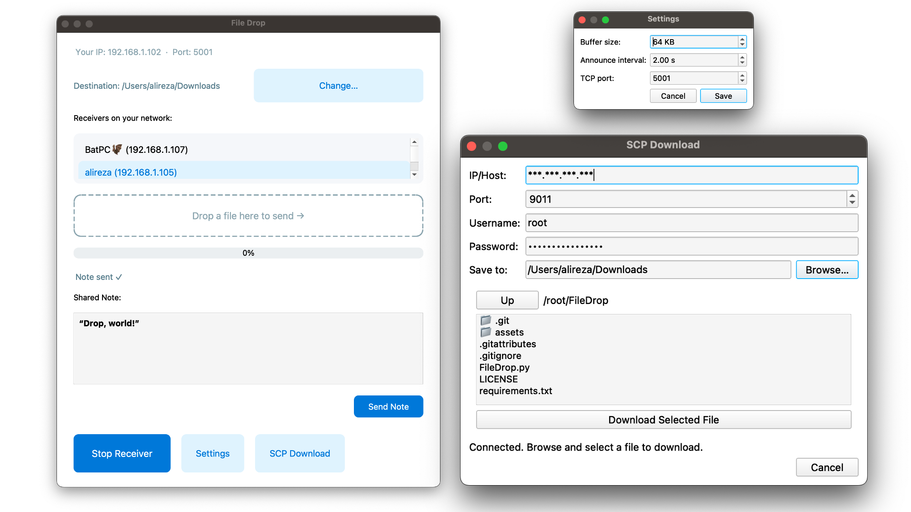
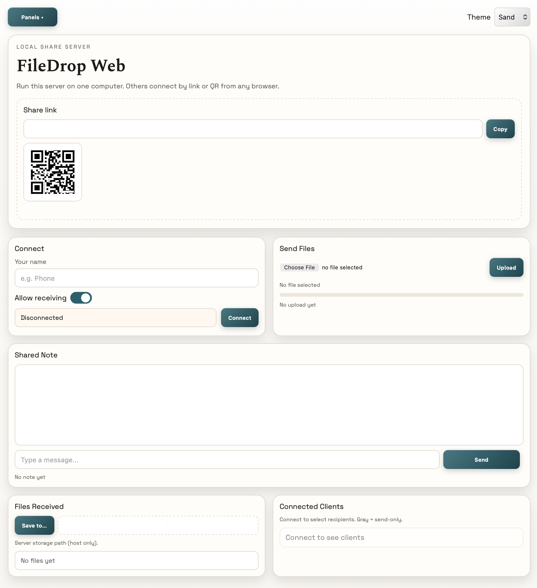

# FileDrop
---
##### Jul 11, 2025 | S.Alireza Hashemi




## FileDrop

I wrote FileDrop because I was tired of swapping USB drives and typing long `scp` commands.

* **Send files or text on your LAN** – drag a file or paste a note and it shows up on any computer running FileDrop.  
* **Fetch files over SSH** – sign in, browse, click to download. Without typing long commands.

Run it on each machine and start moving your stuff.

## FileDrop Web (V2)

Lightweight web-based companion for LAN sharing. Start a local server, share a link or QR, and send files or notes between any browser (desktop or phone) on your network — no app install required.



### Downloads (V2)

| Platform | File |
|----------|------|
| Linux | [FileDrop-linux](https://github.com/salireza111/FileDrop/releases/download/v2.0.9.2/FileDrop-v2.0.9.2-linux.AppImage) |
| macOS | [FileDrop-mac](https://github.com/salireza111/FileDrop/releases/download/v2.0.9.2/FileDrop-v2.0.9.2-mac.dmg) |
| Windows | [FileDrop-windows](https://github.com/salireza111/FileDrop/releases/download/v2.0.9.2/FileDrop-v2.0.9.2-windows.exe) |

## 📦 Install on macOS (Homebrew)

```bash
# Add the tap once
brew tap salireza111/filedrop

# Then install or upgrade any time
brew install --cask filedrop
```
## 📦 Snap
[](https://snapcraft.io/filedrop)

### Roadmap

- [ ] Upload files to servers via SCP  
- [ ] Encrypted connections  
- [ ] Use password for connection
